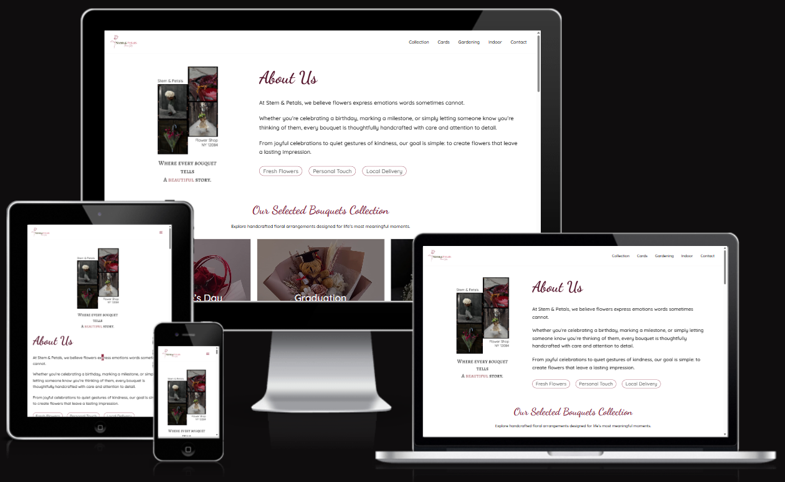

# Stem & Petals - Flower Shop
Frontend Development - WordPress

### Description
A responsive multi-page flower shop catalog website created with **WordPress** using the **Astra** theme and custom patterns. The project showcases a complete small business website with multiple product collections, informational pages and a contact form.

### Features
* Responsive design for desktop, tablet and mobile devices
* 12 custom-designed pages
* Multiple bouquet collection pages
* Custom cards, indoor plants and gardening sections
* Contact page with business information and inquiry form
* Consistent branding and visual identity
* Smooth fade-in animations on loading
* Interactive navigation and hover effects

### Tools
* WordPress
* Astra Theme
* Gutenberg Block Editor
* Custom Patterns
* Custom CSS
* WPForms
* Canva (custom graphics and illustrations)
* Simply Static (static site generation)

### Structure
The website contains 12 pages:
* Home
* Collection
  * Valentine's Day
  * Graduation
  * Wedding
  * Baby Showers
  * Seasonal
  * Everyday
* Cards
* Indoor
* Gardening
* Contact

### Purpose
This project was created to practice:
* WordPress website development
* Responsive web design
* Layout composition with Gutenberg blocks
* Theme customization
* UI/UX consistency
* Static website deployment

### Preview

